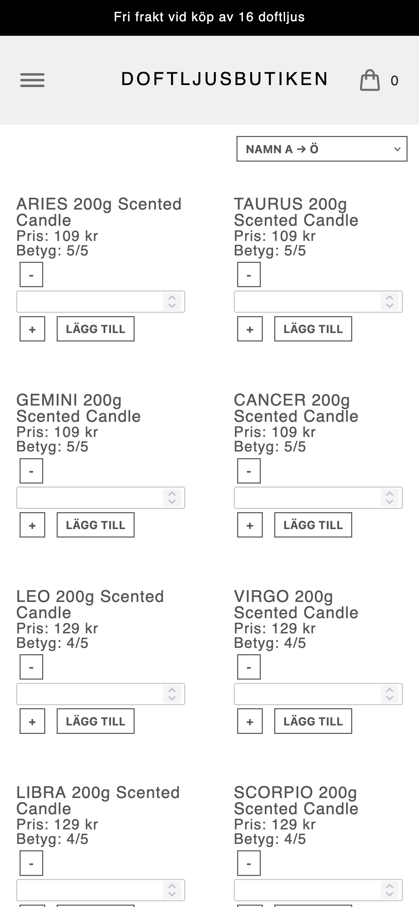

# Webbshop - JavaScript Inlämning 1

En webbshop byggd med HTML, SCSS och Vanilla JavaScript. Projektet är gjort som en del av JavaScript-kursen och fokuserar på HTML och JavaScript snarare än avancerad design. JavaScript-koden är självdokumenterande och har rensats från pseudokod under projektets gång för bättre läsbarhet. Projektet har ambitionsnivå G.

## Funktioner

- Produktlista med minst 10 produkter och flera kategorier
- Filtrering av produkter baserat på kategori
- Sortera på pris och rating
- 3 st affärsregler
- Bekräftelseruta efter genomförd beställning
- Responsiv layout för mobil, tablet och desktop
- Feedback på varukorgsikon
- Tillgänglighet har vägts in och finns utrymme för förbättringar.

## Tekniker

- HTML5
- SCSS (Sass)
- Vanilla JavaScript
- GitHub Pages

## Validering och tillgänglighet

- HTML och CSS har validerats med W3C Validator
- Sidan har testats med tillgänglighetsverktyg i Firefox.
- Tangentbordsnavigering är testad
- Semantisk HTML
- aria-attribut där det varit relevant

## Live-sida (GitHub Pages)

https://ngeliecode.github.io/fed25d-javascript-inl-1-webbshop/

## Screenshots på slutresultat

### Startsida

## Författare

Angelie
